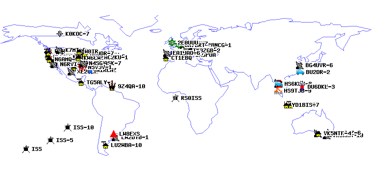

# 把你的名字，刻在星星上

—— auto biu~

提醒：使用无线电台需要遵守国家相关法律法规

## 前言

国际空间站上有一部专门用于APRS通信用的电台，除宇航员出仓及飞船对接的时间外，基本都是全天开启状态，为全球业余无线电爱好者提供APRS中继服务，每5分钟发送一次信标。在网站<http://www.ariss.net/>的页面上，可以看到最近若干小时内通过这部中继工作的全球台站情况。



目前大部分时间，地图上中国区域的台站都非常稀少，为了能让这张地图上显示更多的中国呼号，我现开源自己编写的一个简单的程序。程序使用direwolf软件的kiss协议网络接口来控制电台，自动向国际空间站中继发送信标。我给它取了一个比较土气的名字：**auto biu~**

虽然通过direwolf软件的信标配置功能，也可以定时发送信号，但长时间短间隔的定时发送，将对珍贵的业余卫星通信频率造成不必要的干扰。《auto biu》工作的基本思路是，平时守听空间站频点，一旦收到空间站APRS信号，程序会自动进入一个最长为几分钟的自动间歇发送状态。此期间如果自己的信号被ISS转发，并被地面网关接收转发至aprsis网络，则本次提前工作结束，等待下一次ISS过境。

## 使用方法

**本程序只能在linux系统下使用。** 各种Pi、Debian、Ubuntu系统应该都可以，因为大多数火腿的direwolf软件都是安装在linux系统下的，所以系统要求应该很容易满足。代码使用起来还算简单，但因为它是配合direwolf软件使用的，所以先对direwolf软件的安装配置做一些必要的介绍，方便没有用过的朋友参考。如果你的direwolf已经在安装配置完毕，可以正常接收和发射射频信号，那么可以跳过下面这一段。

### direwolf 安装与配置

direwolf 是美国爱好者 wb2osz 写的一款APRS开源软件，功能强大，软件主页<https://github.com/wb2osz/direwolf>。软件支持iGate、DIGI、Tracker模式，支持多种协议，支持声卡虚拟为TNC，支持多种通信协议，解码率强悍，超越硬件TNC。

国内的火腿一般会把这款软件用于iGate，它支持使用RTL芯片的电视棒直接实现单向iGate功能，在国内爱好者中比较普及。bg9ega有篇文章 [APRS折腾之：IGate网关](https://bg9ega.cn/290.html)，在网络上出现得较早，非常有参考价值，我也是通过这篇文章才接触的direwolf这个软件。

direwolf软件的安装和配置过程，上面这篇文章已经基本讲得比较全面了。但上文是单向接收，关于控制发射，在软件文档中有较详细的说明。在direwolf源代码目录下doc文件夹下《User-Guide.pdf》文件的第76页中，推荐了几个链接可以仔细参考。其中<http://www.repeater-builder.com/projects/fob/USB-Fob-Construction.pdf>这篇文章，专门介绍了使用CM108芯片的外置USB声卡来直接控制电台进行接收和发射的方法。

### autobiu 的使用

#### 前提

当你的direwolf软件已经连接好电台，能够正常地接收发射ARPS信号(灵敏度和发射效率正常，并且天线的形式和极化方向也已合适)，就可以继续往下看了。（有兴趣的朋友也可就此另外讨论，此处不再赘述）

#### 安装编译环境

如果是按上面[bg9ega 的文章](https://bg9ega.cn/290.html)来安装的direwolf软件，那么编译本程序所需要的工具其实都已经安装好了。为了避免遗漏，这里重新说明一下编译本软件所需要安装的工具（以下命令即使发生了重复操作也没有不良影响）：

```bash
sudo apt update
sudo apt upgrade
sudo apt install git make gcc nano
```

#### 编译 autobiu

输入如下命令：

```bash
cd
git clone https://gitee.com/bg4uvr/autobiu
cd autobiu
make
```

#### 配置 autobiu

此时编译工作已经完成，我们来第一次运行程序

```bash
./autobiu
```

程序首次运行会因为程序没有找到配置文件，而只显示一些提示消息就退出了，同时它会在当前目录生成一个配置文件模板文件，现在运行如下命令来编辑这个文件：

```bash
nano autobiu.conf
```

文件中，只有6个配置项：

* “**server_kiss**”，是指运行direwolf程序电脑的IP地址。当本软件和direwolf是在同一台机器上运行时，那么保持“127.0.0.1”无需改变，否则需要更改成direwolf软件所在电脑的实际IP地址。
* “**port_kiss**”，指direwolf软件的kiss协议端口，如果你没有特意的配置过，那么默认为“8001”。
* “**server_aprs**”，是指aprsis服务器地址，如无特别原因无需改变默认设置。
* “**port_aprs**”，是指aprsis服务器端口号，如无特别原因无需改变默认设置。
* “**mycall**”，你的呼号加ssid，格式形如“BGnXXX-nn”，注意不要输错，因为程序没对输入做合法性判断，如果你错误输入，可能无法正确运行，甚至干扰正常秩序。
* “**msg**”，这是你需要设置的发送消息语句，**此处输入的消息语句内容要严格符合aprs-is的格式规则，否则你的发送数据包可能无法被aprs-is网络正确识别**。如果不清楚详细规则，最简单的办法就是直接照抄自己已经发送上网语句的消息段。注意，需要从冒号后开始（不包括冒号本身），一直到换行结束。

#### 运行 autobiu

以上配置结束后，按```ctrl + x``` 组合键，再按```y```来确定，保存退出。然后运行：

```bash
./autobiu -d
```

参数```-d```的含义是，以调试模式运行程序。此时电台正在接收的数据可以直接在屏幕上显示出来，如果是接收到空间站的数据，则同时可以显示出相关的工作状态。此时如需中止程序运行，可以按组合键```ctrl+c```。

如果确认程序已能正常工作，无需监看，那么可以直接运行```./autobiu```，程序会在显示少量文字提示后，转入后台模式，此时退出登录或直接关闭ssh窗口不会影响到软件正常运行。

无论是调试模式还是后台模式，程序在工作时都会将详细的工作情况记入日志文件，方便过后查看。日志文件保存目录为当前目录，以当前日期为文件名，每日新建。可以使用```cat```命令或```nano```编辑器来查看，如```cat 2023-02-22.log```或```nano 2023-02-22.log```。

#### 检查和中止进程

查看工作进程情况可以使用```ps -ef |grep autobiu|grep -v grep```命令，后台模式下会看到2个进程，调试模式下1个。**可以使用命令```pkill autobiu```来结束运行中的autobiu软件进程**。

#### 开机自动运行

1. 编辑 /etc/rc.local 文件，运行命令：```sudo nano /etc/rc.local```

2. 在文件中加入这行命令```/home/你的登录用户名/autobiu/autobiu```，注意如果文件最后一行是```exit 0```，那么需要加在这行之前才行。

3. 按组合键```ctrl + x```，再按```y```，来保存文件。

4. 如果文件打开后是全空没有内容，说明系统原来不存在这个文件，需要再增加一下执行权限：```sudo chmod +x /etc/rc.local```

5. 如需取消开机自动运行，把刚刚我们加入的那行删除即可。

## 写在后面

因不是专业编程人员，代码非常粗糙，加之未经长期验证，错误不足难免，尤其是kiss协议编解码部分，为全新编写，有较大概率还存在BUG，如发现问题，还请批评指正，谢谢~
